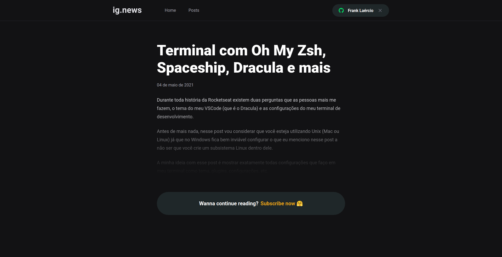

<h2 align="center"> 
  :newspaper: Ignews
</h1>

<p align="center">
  <a href="https://www.linkedin.com/in/frank-laercio/">
    
  </a>
  
  
  
  <a href="https://github.com/franklaercio/ig-news/commits/master">
    
  </a>
  
  

  
   <a href="https://github.com/franklaercio/ig-news/stargazers">
    
  </a>
</p>

## :bookmark_tabs: Resume of application

This is a private blog. It's possible create content with a CMS and receive for subscription an app. The project is a part of Ignite of Rocktseat and use the follow technologies:
* Next.js
* Stripe
* Prismic
* Github Auth 

<p align="center">
  
  
  
  
  
</p>

## 🎲 Running the project

```bash
# Clone this repository
$ git clone https://github.com/franklaercio/ig-news

# Access the project folder in the terminal/cmd
$ cd ig-news

# Set environment
$ cp .env.example .env.local

# Compile the code
$ yarn

# Run stripe webhook and set STRIPE_WEBHOOK_SECRET on .env.local
$ stripe listen --forward-to localhost:3000/api/webhooks 

# Run the application
$ yarn dev
```

## :man_technologist: Authors

* **Frank Laércio** - [franklaercio](https://github.com/franklaercio)

See also the list of [contributors](https://github.com/franklaercio/ig-news/contributors) who participated in this project.

## :clipboard: License

This project is licensed under the MIT License - see the [LICENSE.md](LICENSE.md) file for details

## :newspaper: Acknowledgments

- Next.js

